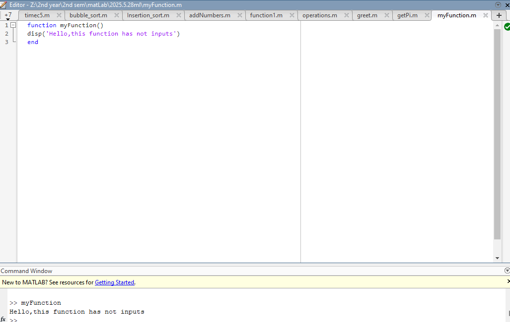
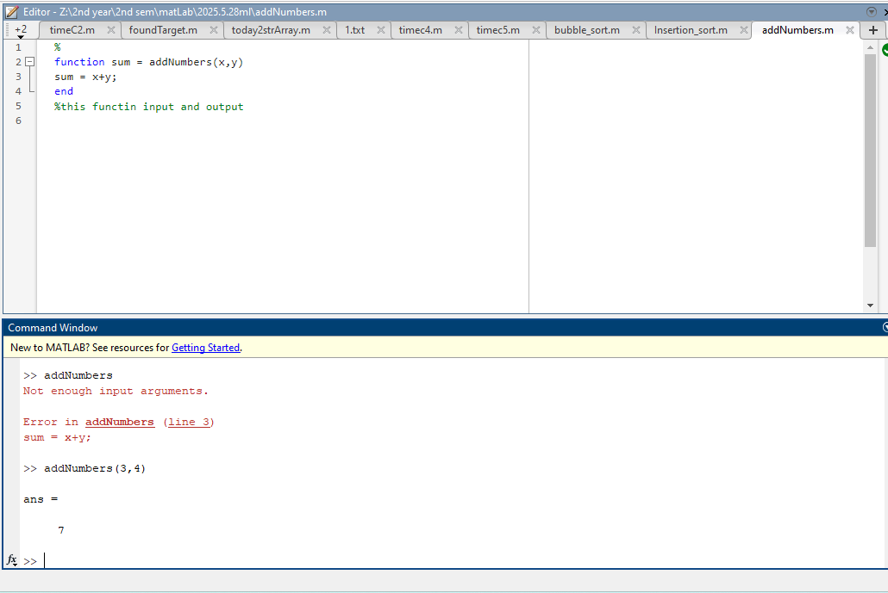
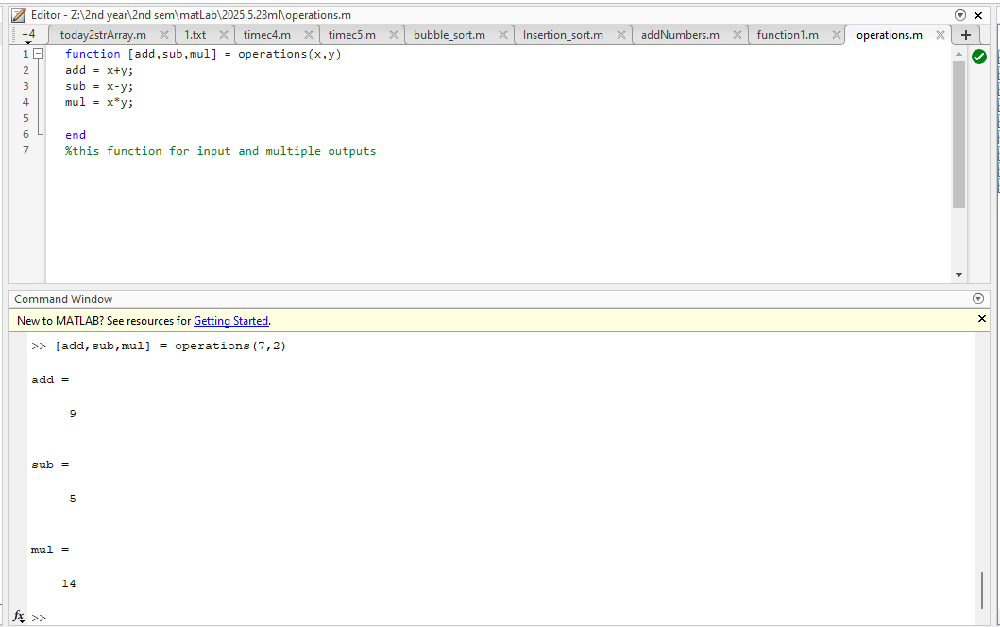
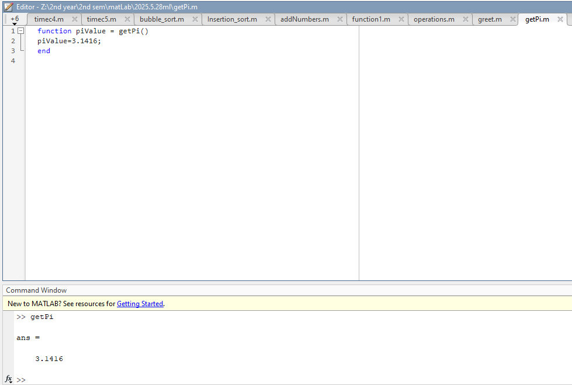
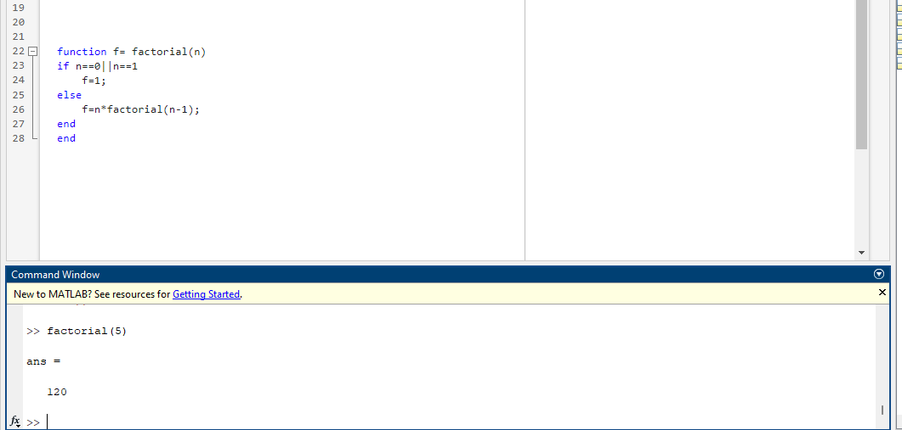
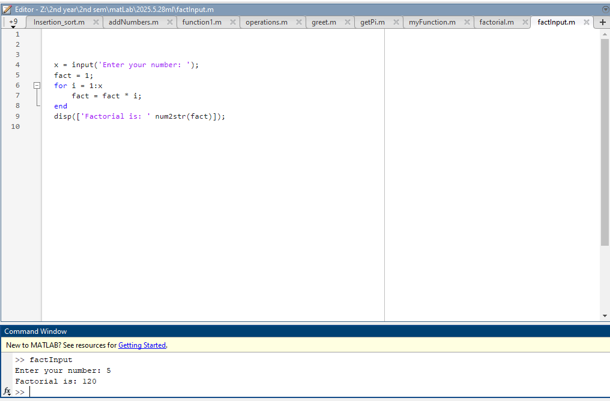

# MATLAB Functions Repository - Day 08

[](https://www.mathworks.com/products/matlab.html)
[]() 
[]()  

> 📚 A comprehensive collection of MATLAB scripts demonstrating function concepts and implementations.

## 📋 Course Overview

This repository contains practical exercises and implementations for the MATLAB course focusing on functions. The examples showcase various MATLAB function types, parameter passing, and return values.

## 🗓️ Day 08 Content: MATLAB Functions

### 🎯 Function Examples

#### 1. Basic Function with No Input/Output

```matlab
% myFunction.m
function myFunction()
    disp('Hello,this function has not inputs')
end
```

**Description**: A simple function with no input parameters and no return values. It just displays a message when called.

**Output:**



#### 2. Function with Input Parameters

```matlab
% greet.m
function greet(name)
    disp(['Hello',name]);
end
```

**Description**: A function that takes a single input parameter (name) and displays a greeting message.

**Output:**


#### 3. Function with Input and Output

```matlab
% addNumbers.m
function sum = addNumbers(x,y)
    sum = x+y;
end
%this functin input and output
```

**Description**: A function that takes two input parameters, adds them together, and returns the result.

**Output:**



#### 4. Function with Multiple Outputs

```matlab
% operations.m
function [add,sub,mul] = operations(x,y)
    add = x+y;
    sub = x-y;
    mul = x*y;
end
%this function for input and multiple outputs
```

**Description**: A function that takes two input parameters and returns multiple values (addition, subtraction, and multiplication results).

**Output:**



#### 5. Function Returning a Constant

```matlab
% getPi.m
function piValue = getPi()
    piValue=3.1416;
end
```

**Description**: A function that returns a constant value (π) without taking any input parameters.

**Output:**



#### 6. Recursive Function

```matlab
% factorial.m
function f = factorial(n)
    if n==0||n==1
        f=1;
    else
        f=n*factorial(n-1);
    end
end
```

**Description**: A recursive function that calculates the factorial of a number by calling itself with a smaller input until it reaches the base case.

**Output:**



#### 7. Script for Factorial Calculation

```matlab
% factInput.m
x = input('Enter your number: ');
fact = 1;
for i = 1:x
    fact = fact * i;
end
disp(['Factorial is: ' num2str(fact)]);
```

**Description**: A script (not a function) that calculates the factorial of a user-input number using a loop approach.

**Output:**



### 📊 Implementation Results

| Function | Description | Output |
|---------|------------|--------|
| myFunction | Function with no inputs or outputs |  |
| greet | Function with input parameter |  |
| addNumbers | Function with input and output |  |
| operations | Function with multiple outputs |  |
| getPi | Function returning a constant |  |
| factorial | Recursive function |  |
| factInput | Script for factorial calculation |  |

### 🔍 Technical Notes

- Functions in MATLAB are defined using the `function` keyword
- Function files must have the same name as the function they contain
- Functions can have zero, one, or multiple input parameters
- Functions can return zero, one, or multiple output values
- Recursive functions call themselves with a smaller problem until reaching a base case
- MATLAB scripts (like factInput.m) don't use the function keyword and operate in the base workspace

## How to Run the Scripts
1. Open MATLAB.
2. Navigate to the Code directory.
3. Run a function by typing its name with appropriate parameters in the command window.
4. For scripts, simply type the script name to execute it.

---

<div align="center">

📖 **MATLAB Functions** | 🛠️ **Practical Examples** | 📊 **Visual Outputs**

</div>
