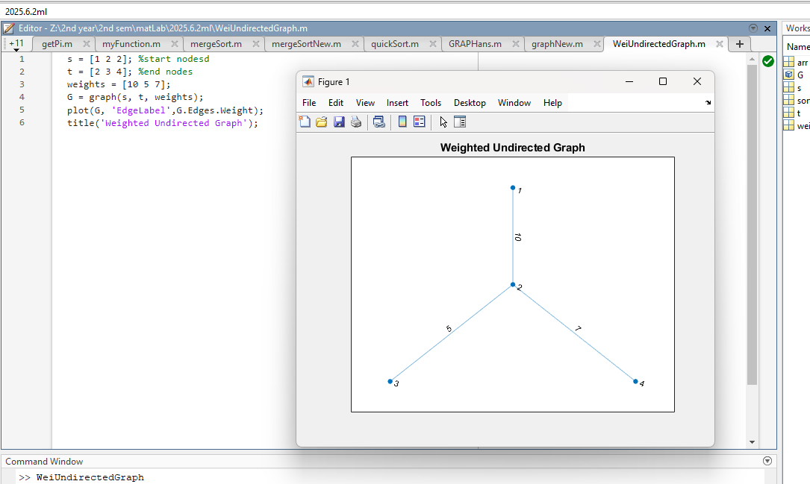
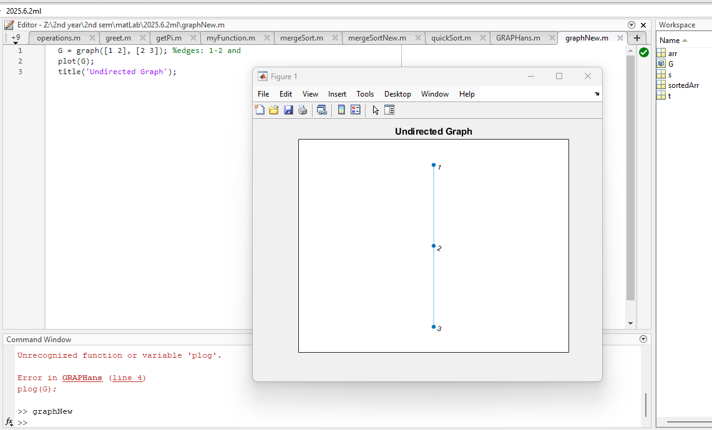

# MATLAB Code Repository - Graph Implementations

[](https://www.mathworks.com/products/matlab.html)
[]() 
[]()  

> 📚 A comprehensive collection of MATLAB scripts demonstrating graph implementation concepts.

## 📋 Course Overview

This repository contains practical exercises and implementations for the MATLAB course focusing on graph theory. The examples showcase various MATLAB graph creation and visualization techniques.

## 🗓️ Content

### 🎯 Graph Implementation Exercises

#### 1. Weighted Undirected Graph

**Code:**
```matlab
s = [1 2 2]; %start nodes
t = [2 3 4]; %end nodes
weights = [10 5 7];
G = graph(s, t, weights);
plot(G, 'EdgeLabel',G.Edges.Weight);
title('Weighted Undirected Graph');
```

**Explanation:**
This script creates a weighted undirected graph with 4 nodes and 3 edges. The edges connect nodes 1-2, 2-3, and 2-4 with weights of 10, 5, and 7 respectively. The graph is plotted with edge weights displayed as labels.

**Output:**



#### 2. Simple Undirected Graph

**Code:**
```matlab
G = graph([1 2], [2 3]); %edges: 1-2 and 2-3
plot(G);
title('Undirected Graph');
```

**Explanation:**
This script creates a simple undirected graph with 3 nodes and 2 edges. The edges connect nodes 1-2 and 2-3. The graph is plotted without edge weights.

**Output:**



#### 3. Basic Graph (with Error)

**Code:**
```matlab
s = [1 2] %start nodes
t = [2 3] %end nodes
G = graph(s, t); %create a graph object
plog(G); %typo in function name (should be plot)
title('Graph'); %ADD A TITLE
```

**Explanation:**
This script attempts to create a basic graph similar to the second example, but contains a typo in the plotting function (`plog` instead of `plot`), which would cause an error when executed. The correct implementation would create a graph with 3 nodes and 2 edges connecting nodes 1-2 and 2-3.

### 📊 Implementation Results

| Script | Description | Output |
|---------|--------|--------|
| WeiUndirectedGraph.m | Creates a weighted undirected graph with 4 nodes and 3 weighted edges |  |
| graphNew.m | Creates a simple undirected graph with 3 nodes and 2 edges |  |
| GRAPHans.m | Attempts to create a basic graph but contains a function name typo | No output due to error |

### 🔍 Technical Notes

- All implementations use MATLAB's `graph` function to create undirected graphs
- The `plot` function is used to visualize the graphs
- Edge weights can be displayed using the 'EdgeLabel' property
- The `digraph` function (partially shown in graphNew.m) can be used to create directed graphs

## How to Run the Scripts
1. Open MATLAB.
2. Navigate to the Code directory.
3. Run the desired script by typing its name (without the .m extension) in the MATLAB command window or by clicking the Run button.
4. Observe the graph visualization in the figure window.

---

<div align="center">

📖 **Graph Theory** | 🛠️ **MATLAB Implementation** | 📊 **Visual Representations**

</div>
