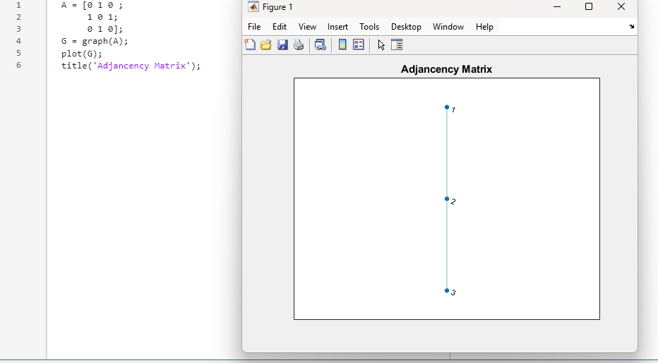
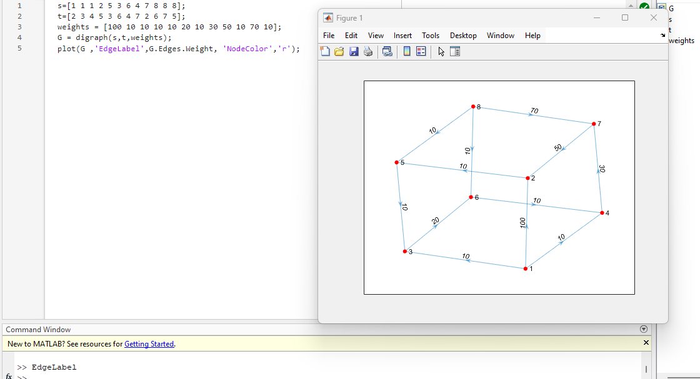
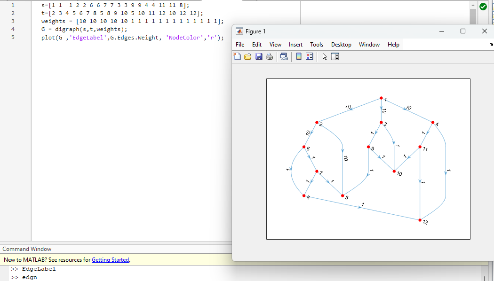
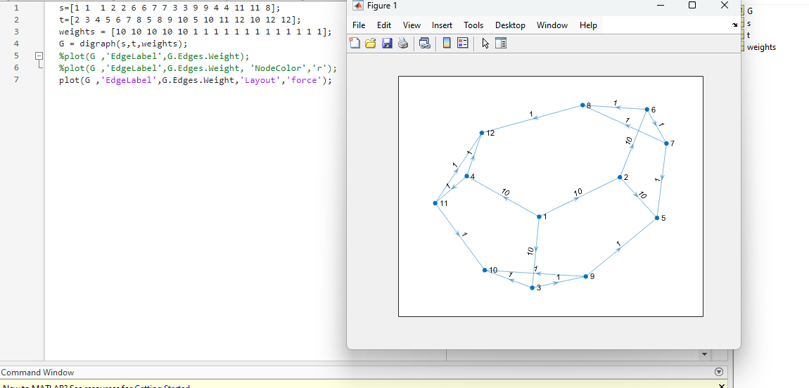
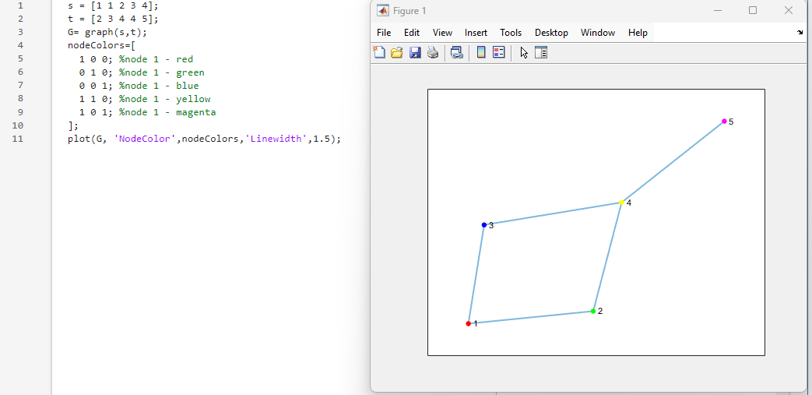
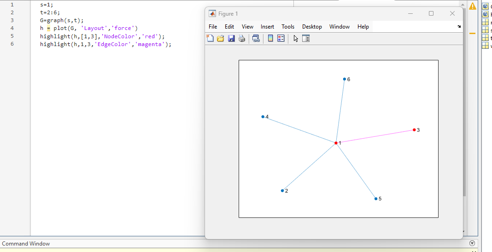
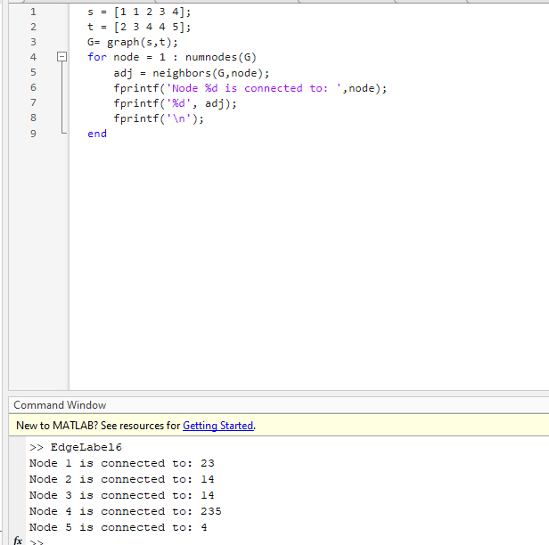
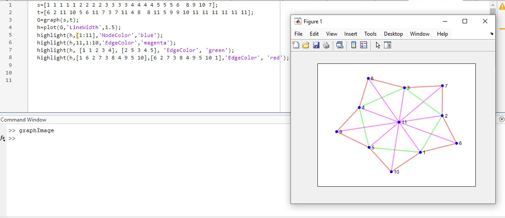

# MATLAB Code Repository - Graph Visualization

[](https://www.mathworks.com/products/matlab.html)
[]() 
[]()  

> 📚 A comprehensive collection of MATLAB scripts demonstrating graph visualization techniques.

## 📋 Course Overview

This repository contains practical exercises and implementations for the MATLAB course focusing on graph visualization. The examples showcase various MATLAB graph plotting techniques and applications.

## 🗓️ Content

### 🎯 Graph Visualization Examples

#### 1. Adjacency Matrix Graph

```matlab
A = [0 1 0 ;
     1 0 1;
     0 1 0];
G = graph(A);
plot(G);
title('Adjancency Matrix');
```

This code creates a graph from an adjacency matrix and plots it with a title. The adjacency matrix represents connections between nodes where 1 indicates a connection and 0 indicates no connection.

**Output:**



#### 2. Directed Graph with Edge Weights

```matlab
s=[1 1 1 2 5 3 6 4 7 8 8 8];
t=[2 3 4 5 3 6 4 7 2 6 7 5];
weights = [100 10 10 10 10 20 10 30 50 10 70 10];
G = digraph(s,t,weights);
plot(G ,'EdgeLabel',G.Edges.Weight, 'NodeColor','r');
```

This code creates a directed graph with weighted edges. The source nodes (s), target nodes (t), and weights are defined as arrays. The graph is plotted with edge labels showing the weights and red node colors.

**Output:**



#### 3. Complex Directed Graph with Red Nodes

```matlab
s=[1 1  1 2 2 6 6 7 7 3 3 9 9 4 4 11 11 8];
t=[2 3 4 5 6 7 8 5 8 9 10 5 10 11 12 10 12 12];
weights = [10 10 10 10 10 1 1 1 1 1 1 1 1 1 1 1 1 1];
G = digraph(s,t,weights);
plot(G ,'EdgeLabel',G.Edges.Weight, 'NodeColor','r');
```

This code creates a more complex directed graph with weighted edges. The graph is plotted with edge labels showing the weights and red node colors.

**Output:**



#### 4. Force-Directed Layout Graph

```matlab
s=[1 1  1 2 2 6 6 7 7 3 3 9 9 4 4 11 11 8];
t=[2 3 4 5 6 7 8 5 8 9 10 5 10 11 12 10 12 12];
weights = [10 10 10 10 10 1 1 1 1 1 1 1 1 1 1 1 1 1];
G = digraph(s,t,weights);
plot(G ,'EdgeLabel',G.Edges.Weight,'Layout','force');
```

This code creates the same graph as the previous example but uses a force-directed layout algorithm for node positioning, which can better visualize complex graph structures.

**Output:**



#### 5. Custom Node Colors

```matlab
s = [1 1 2 3 4];
t = [2 3 4 4 5];
G= graph(s,t);
nodeColors=[
  1 0 0; %node 1 - red
  0 1 0; %node 2 - green 
  0 0 1; %node 3 - blue
  1 1 0; %node 4 - yellow
  1 0 1; %node 5 - magenta
];
plot(G, 'NodeColor',nodeColors,'Linewidth',1.5);
```

This code creates a simple undirected graph and assigns custom colors to each node using RGB values. The edges are also made thicker with the 'Linewidth' parameter.

**Output:**



#### 6. Node and Edge Highlighting

```matlab
s=1;
t=2:6;
G=graph(s,t);
h = plot(G, 'Layout','force')
highlight(h,[1,3],'NodeColor','red');
highlight(h,1,3,'EdgeColor','magenta');
```

This code creates a star-shaped graph with node 1 connected to nodes 2 through 6. It then highlights specific nodes (1 and 3) in red and the edge between nodes 1 and 3 in magenta.

**Output:**



#### 7. Graph Neighbor Analysis

```matlab
s = [1 1 2 3 4];
t = [2 3 4 4 5];
G= graph(s,t);
for node = 1 : numnodes(G)
    adj = neighbors(G,node);
    fprintf('Node %d is connected to: ',node);
    fprintf('%d', adj);
    fprintf('\n');
end
```

This code creates a simple undirected graph and then iterates through each node to find and print its neighboring nodes, demonstrating how to analyze graph connectivity programmatically.

**Output:**



#### 8. Complex Graph with Multiple Highlighting

```matlab
s=[1 1 1 1 1 2 2 2 2 3 3 3 3 4 4 4 4 5 5 5 6  8 9 10 7];
t=[6 2 11 10 5 6 11 7 3 7 11 4 8  8 11 5 9 9 10 11 11 11 11 11 11];
G=graph(s,t);
h=plot(G,'LineWidth',2.5);
highlight(h,[1:11],'NodeColor','blue');
highlight(h,11,1:10,'EdgeColor','magenta');
highlight(h, [1 1 2 3 4], [2 5 3 4 5], 'EdgeColor', 'green');
highlight(h,[1 6 2 7 3 8 4 9 5 10],[6 2 7 3 8 4 9 5 10 1],'EdgeColor', 'red');
```

This code creates a complex undirected graph and applies multiple highlighting effects: all nodes are colored blue, edges from node 11 to nodes 1-10 are colored magenta, specific edges are colored green, and a cycle of edges is colored red.

**Output:**



### 📊 Implementation Results

| Example | Description | Output |
|---------|-------------|--------|
| Adjacency Matrix Graph | Creates a graph from an adjacency matrix |  |
| Directed Graph with Edge Weights | Creates a directed graph with weighted edges |  |
| Complex Directed Graph with Red Nodes | Creates a more complex directed graph |  |
| Force-Directed Layout Graph | Uses force-directed layout for better visualization |  |
| Custom Node Colors | Assigns custom colors to each node |  |
| Node and Edge Highlighting | Highlights specific nodes and edges |  |
| Graph Neighbor Analysis | Analyzes and prints graph connectivity |  |
| Complex Graph with Multiple Highlighting | Applies multiple highlighting effects |  |

### 🔍 Technical Notes

- All implementations are in MATLAB
- The examples demonstrate various graph visualization techniques:
  - Creating graphs from adjacency matrices
  - Creating directed and undirected graphs
  - Adding edge weights and labels
  - Customizing node colors
  - Highlighting nodes and edges
  - Using different layout algorithms
  - Analyzing graph connectivity

## How to Run the Scripts
1. Open MATLAB.
2. Navigate to the Code directory.
3. Run any of the `.m` files to see the corresponding graph visualization.
4. Modify parameters to experiment with different graph structures and visualizations.

---

<div align="center">

📖 **Graph Theory** | 🛠️ **MATLAB Visualization** | 📊 **Network Analysis**

</div>
