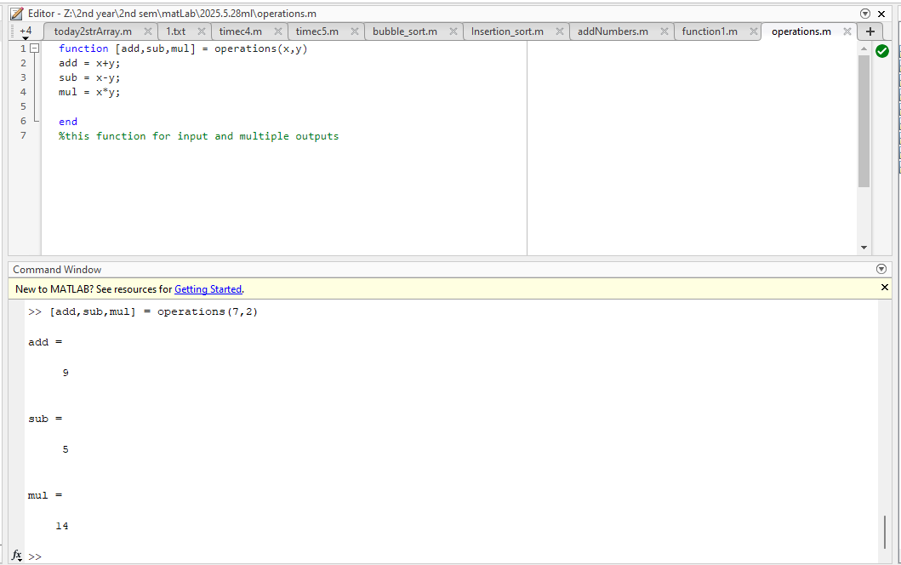
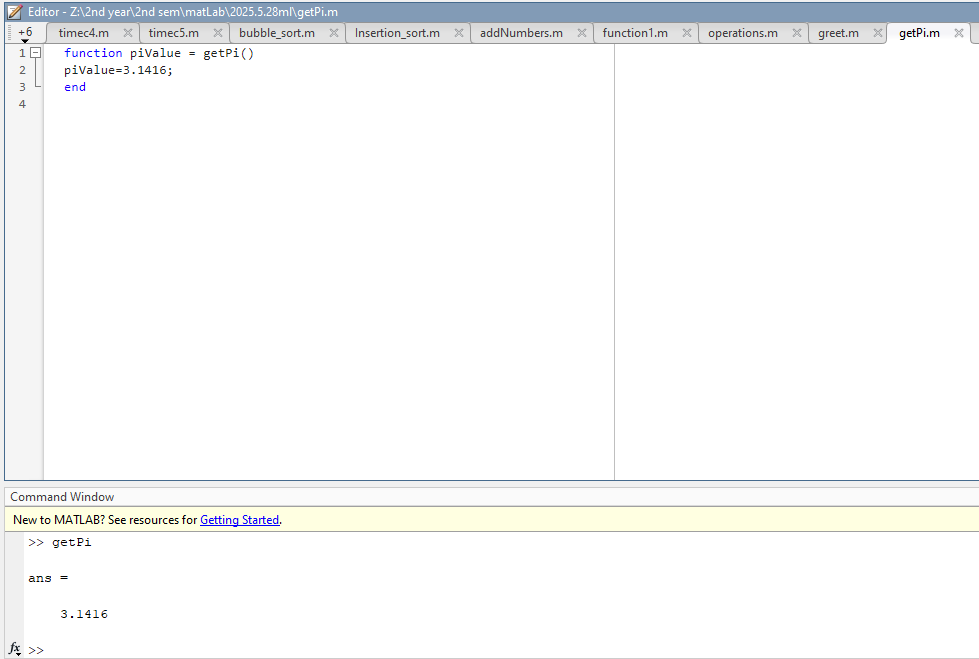

# MATLAB Code Repository - Day 09

[](https://www.mathworks.com/products/matlab.html)
[]() 
[]()

> 📚 A comprehensive collection of MATLAB functions demonstrating various function types and implementations.

## 📋 Course Overview

This repository contains practical exercises and implementations for the MATLAB course. Each example demonstrates different aspects of MATLAB functions including input parameters, return values, and recursive implementations.

## 🗓️ Day 09 Content

### 🎯 Programming Exercises

#### 1. Basic Function with Input and Output

```matlab
function sum = addNumbers(x,y)
sum = x+y;
end
%this function input and output
```

**Explanation:**
- Takes two input parameters (x and y)
- Returns their sum as the output
- Demonstrates basic function structure with inputs and output


#### 2. Function with Multiple Outputs

```matlab
function [add,sub,mul] = operations(x,y)
add = x+y;
sub = x-y;
mul = x*y;
end
%this function for input and multiple outputs
```

**Explanation:**
- Takes two input parameters (x and y)
- Returns multiple values (addition, subtraction, multiplication)
- Shows how to return multiple outputs from a single function



#### 3. Function with Input but No Output

```matlab
function greet(name)
disp(['Hello',name]);
end
```

**Explanation:**
- Takes one input parameter (name)
- Displays a greeting message
- No return value (void function)


#### 4. Function with Output but No Input

```matlab
function piValue = getPi()
piValue=3.1416;
end
```

**Explanation:**
- No input parameters
- Returns a constant value (π)
- Demonstrates functions that generate values without inputs



#### 5. Function with No Input and No Output

```matlab
function myFunction()
disp('Hello,this function has not inputs');
end
```

**Explanation:**
- No input parameters
- No return value
- Simply displays a message when called


#### 6. Recursive Function

```matlab
function f = factorial(n)
if n==0||n==1
    f=1;
else
    f=n*factorial(n-1);
end
end
```

**Explanation:**
- Takes one input parameter (n)
- Calculates factorial using recursion
- Base case: 0! or 1! equals 1
- Recursive case: n! = n × (n-1)!


### 📊 Implementation Results

| Function Type | Description | Output |
|---------|-------------|--------|
| Basic Function | Addition with input/output |  |
| Multiple Outputs | Operations returning multiple values |  |
| Input Only | Greeting function with no return |  |
| Output Only | Pi value function with no input |  |
| No Input/Output | Simple display function |  |
| Recursive | Factorial calculation |  |

### 🔍 Technical Notes

- All implementations are in MATLAB
- Each function demonstrates different programming concepts:
  - Function declaration and structure
  - Parameter passing
  - Return value handling
  - Multiple return values
  - Recursion
  - Void functions

## How to Run the Scripts
1. Open MATLAB.
2. Copy and paste the desired function into a `.m` file with the same name as the function.
3. Call the function from the MATLAB command window with appropriate parameters.
4. Observe the output in the command window.

---

<div align="center">

📖 **Learning Path** | 🛠️ **Practical Examples** | 📊 **Visual Outputs**

</div>