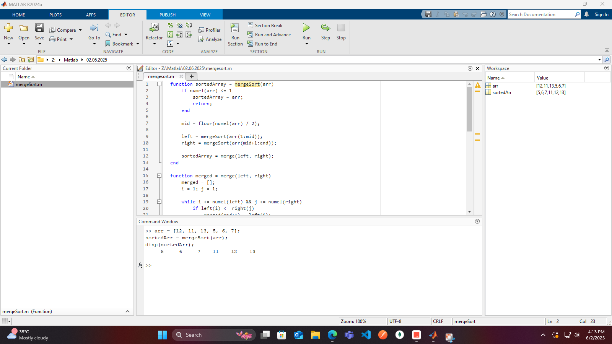

# MATLAB Sorting Algorithms Repository

[](https://www.mathworks.com/products/matlab.html)
[]()
[]()

> 📚 Implementation of fundamental sorting algorithms in MATLAB

## 📋 Repository Contents

### 1. QuickSort Algorithm

`Code/quickSort.m`
```matlab
function sorted = quickSort(arr)
    if numel(arr) <= 1
        sorted = arr;
        return;
    end
    
    pivot = arr(1);
    left = arr(arr < pivot);
    equal = arr(arr == pivot);
    right = arr(arr > pivot);
    
    sorted = [quickSort(left), equal, quickSort(right)];
end
```

**Explanation:**
- Implements the QuickSort algorithm using recursion
- Chooses first element as pivot
- Divides array into three parts: elements less than, equal to, and greater than pivot
- Recursively sorts left and right partitions


### 2. MergeSort Algorithm

`Code/mergeSort.m`
```matlab
function sortedArray = mergeSort(arr)
    if numel(arr) <= 1
        sortedArray = arr;
        return;
    end

    mid = floor(numel(arr) / 2);
    left = mergeSort(arr(1:mid));
    right = mergeSort(arr(mid+1:end));
    sortedArray = merge(left, right);
end

function merged = merge(left, right)
    merged = [];
    i = 1; j = 1;

    while i <= numel(left) && j <= numel(right)
        if left(i) <= right(j)
            merged(end+1) = left(i);
            i = i + 1;
        else
            merged(end+1) = right(j);
            j = j + 1;
        end
    end

    % Append remaining elements
    if i <= numel(left)
        merged = [merged, left(i:end)];
    end
    if j <= numel(right)
        merged = [merged, right(j:end)];
    end
end
```

**Explanation:**
- Implements the MergeSort algorithm using divide-and-conquer approach
- Recursively splits array into halves until single elements remain
- Merges sorted halves while maintaining order
- merge() function handles the combination of sorted subarrays



## 🧪 How to Test
1. Open MATLAB and navigate to repository root
2. Create test arrays in MATLAB command window:
```matlab
arr = [3, 1, 4, 1, 5, 9, 2, 6, 5, 3];
```
3. Run sorting algorithms:
```matlab
quickSorted = quickSort(arr)
mergeSorted = mergeSort(arr)
```
4. Compare results with MATLAB's built-in sort:
```matlab
isequal(quickSorted, sort(arr)) && isequal(mergeSorted, sort(arr))
```

## 📊 Algorithm Comparison
| Algorithm | Time Complexity | Space Complexity | Stable |
|-----------|-----------------|------------------|--------|
| QuickSort | O(n log n)      | O(log n)         | No     |
| MergeSort | O(n log n)      | O(n)             | Yes    |

---

<div align="center">
📖 **Sorting Algorithms** | 🛠️ **MATLAB Implementation** | 📊 **Performance Analysis**
</div>